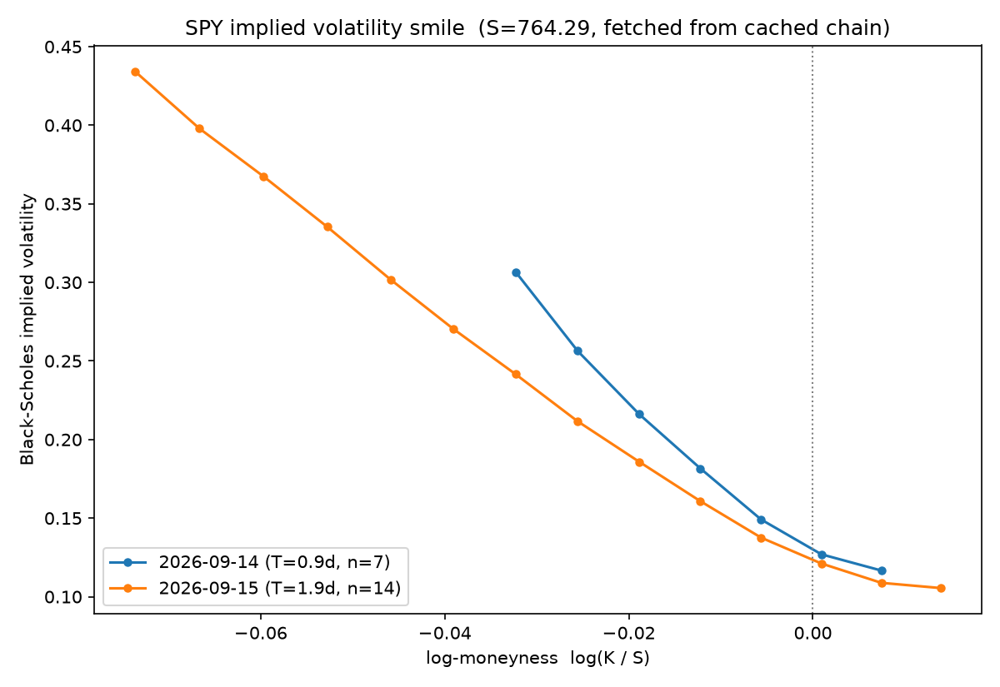

# option-pricing

A from-scratch options pricing library: closed-form Black-Scholes-Merton
with analytic Greeks, a Cox-Ross-Rubinstein binomial tree with American
exercise, Monte Carlo simulation with variance reduction, and a Brent's-method
implied volatility solver used to back out a real SPY volatility smile.

Built as an interview portfolio piece, so every function is tested against a
known analytical property (put-call parity, a finite-difference Greek,
convergence to a closed form, a round-trip inversion) rather than a single
hardcoded expected value — the point is to be able to defend every line, not
just to have it pass.

## Quick start

```bash
uv sync
uv run pytest
```

Zero setup beyond `uv` — no API keys, no external services. The one script
that touches the network (`scripts/fetch_chain.py`) already ran once and its
output is committed to `data/spy_chain.csv`, so `scripts/plot_smile.py` and
the figure below reproduce offline.

## What's here

```
src/pricing/
  black_scholes.py    closed-form European price + delta/gamma/vega/theta/rho
  binomial.py          CRR tree, European and American exercise
  monte_carlo.py        naive / antithetic / control-variate GBM simulation
  implied_vol.py        Brent's-method inversion, with no-arbitrage checks
  surface.py            pure chain-filtering + smile-construction helpers
scripts/
  fetch_chain.py         pulls a live SPY chain via yfinance -> data/
  plot_smile.py           builds figures/smile.png from the cached chain
tests/                    one file per pricing module, plus test_parity.py
cpp/                      C++ Monte Carlo engine — see below
benchmarks/               numpy vs. C++ throughput benchmark
```

`src/pricing/*` is intentionally pure — no I/O, no plotting, numpy in and
numpy out — so every pricing function is trivial to unit test and the
network/plotting code in `scripts/` stays separate from the math.

## C++ Monte Carlo engine

`src/pricing/monte_carlo.py` is the reference implementation: validated,
readable, numpy-vectorized. `cpp/` is a from-scratch second implementation of
the same three estimators (naive, antithetic, control variate) in C++,
exposed back to Python as a `pricing_cpp` extension module via
[pybind11](https://github.com/pybind/pybind11), plus thread-parallel
(`std::thread`) variants of naive and antithetic that split paths across
`std::thread::hardware_concurrency()` threads and combine per-thread Welford
moments with Chan et al.'s parallel-variance formula.

```
cpp/
  include/pricing/monte_carlo.hpp   public API
  src/monte_carlo.cpp               single- and multi-threaded estimators
  src/bindings.cpp                  pybind11 module definition
  tests/test_monte_carlo.cpp        standalone correctness check (no Python)
```

### Build

```bash
uv sync --group dev                              # installs pybind11
uv run cmake -S cpp -B cpp/build -DCMAKE_BUILD_TYPE=Release
uv run cmake --build cpp/build -j
uv run ctest --test-dir cpp/build --output-on-failure   # correctness
uv run python benchmarks/bench_monte_carlo.py            # throughput
```

### What the benchmark found

The first version simply ported the Python loop structure to C++
(`std::mt19937_64` + `std::normal_distribution`, one path per iteration), and
it did **not** beat numpy — it ran at roughly 0.4–0.7x numpy's speed at
every path count tested. Profiling isolated why: `std::normal_distribution`
on libc++ costs about 6x a raw `mt19937_64` draw (~12ns vs ~1.9ns per call,
measured directly), because it draws from the rejection-based Marsaglia
polar method. numpy's `Generator.standard_normal`, by contrast, uses the
Ziggurat algorithm, which only falls back to a transcendental function in
its rare tail case — so numpy's RNG alone is already close to as fast as
this naive C++ loop, before even counting numpy's array-level vectorization.

That ruled out "C++ is faster because it's C++" and pointed at the one
advantage numpy's single-threaded `Generator` genuinely can't match: Monte
Carlo path simulation is embarrassingly parallel. Splitting the same loop
across `std::thread::hardware_concurrency()` threads (8 on the machine these
numbers were measured on) is where the real, reproducible win is:

| estimator | n_paths | numpy | C++ (1 thread) | C++ (8 threads) | speedup vs. numpy |
|---|---:|---:|---:|---:|---:|
| naive | 10,000,000 | 0.192s | 0.288s (0.7x) | 0.060s | 2.6–3.2x |
| antithetic | 10,000,000 | 0.151s | 0.217s (0.7x) | 0.031s | 4.6–6.9x |
| control variate | 10,000,000 | 0.280s | 0.607s (0.5x) | *(not parallelized yet)* | — |

(Run `benchmarks/bench_monte_carlo.py` yourself for current numbers —
timings are single-run wall-clock on one machine, not averaged over
repetitions, and will vary with core count and load. `control_variate`'s
two-pass replay-the-same-stream design wasn't threaded in this pass; that's
the natural next step.)

Both C++ paths are checked against the closed-form Black-Scholes price in
units of their own standard error (the same statistical test
`tests/test_monte_carlo.py` uses), not against numpy's output directly —
two independent random estimators of the same quantity will disagree by a
few standard errors as a matter of course, so bitwise or tight-tolerance
agreement between them would be the wrong thing to assert.

Black-Scholes, the binomial tree, and implied-vol solving haven't been
ported to C++ yet; `src/pricing/` is still the only implementation of those.

## The smile



Two nearest SPY expiries (0.9 and 1.9 calendar days out — SPY lists
near-daily expiries, so "nearest" is always short-dated), spliced from OTM
puts and OTM calls (the liquid side of the chain on each side of the money),
after dropping zero-volume quotes and any quote with a bid-ask spread over
15% of its mid.

## Results

Numbers quoted here come straight from the test suite (`uv run pytest -s`),
not cherry-picked afterward.

**Binomial tree convergence to Black-Scholes** (ATM call, S=K=100, T=1,
r=5%, q=2%, sigma=20%; BS price = 9.227006):

| N steps | tree price | absolute error |
|---:|---:|---:|
| 50 | 9.188225 | 3.88e-2 |
| 200 | 9.217292 | 9.71e-3 |
| 800 | 9.224576 | 2.43e-3 |
| 1000 | 9.225062 | 1.94e-3 |

Error shrinks monotonically and is roughly O(1/N), as expected for CRR. (This
parameter set was chosen deliberately ATM — off-ATM strikes make CRR's
famous non-monotone "zig-zag" convergence show up instead, since the error
also depends on where the strike happens to fall relative to the tree's
terminal nodes at a given N.)

**Monte Carlo variance reduction** (same option, 200,000 paths, one fixed
seed so naive/antithetic/control-variate are directly comparable):

| estimator | standard error | variance reduction vs. naive |
|---|---:|---:|
| naive | 0.030899 | 1.0x |
| antithetic | 0.023007 | 1.80x |
| control variate | 0.012711 | 5.91x |

Control variate wins here because the discounted terminal stock price is
strongly correlated with a near-ATM call payoff (both are increasing
functions of the same terminal draw); antithetic only exploits the weaker
negative correlation between a monotone payoff at `Z` and at `-Z`. All three
estimators landed within 3 standard errors of the closed-form price for both
calls and puts (checked directly via a z-score in `test_monte_carlo.py`).

**The smile itself:** on the near expiry (0.9d), implied vol ranges from
11.7% near the money up to 30.7% for the furthest OTM put; on the 1.9-day
expiry it's 10.5% to 43.4%. A flat 20%-ish surface is what Black-Scholes
would predict for every strike on a given expiry — the market is instead
pricing far-OTM puts several multiples richer than at-the-money.

## Model assumptions and limitations

Black-Scholes-Merton (and the binomial tree, which targets the same
risk-neutral dynamics) assumes:

- **Constant, known volatility** — one sigma for every strike and every
  expiry.
- **Geometric Brownian motion** — returns are lognormal, so the underlying
  never jumps and extreme moves are rarer than they actually are (real
  return distributions have fatter tails).
- **Continuous frictionless hedging** — a market maker can rebalance a
  replicating portfolio continuously at zero transaction cost, which is what
  makes the price genuinely "fair" under the model. Real hedging is
  discrete and costs money, which by itself would already justify some
  compensation baked into the price beyond the textbook formula.
- **Constant r and q** over the life of the option.
- **European exercise unless explicitly relaxed** (the binomial tree's
  `american=True` path is the one place this project actually models early
  exercise).

**Why the smile above is not flat, given those assumptions:** implied
volatility is defined as *whatever sigma makes Black-Scholes match the
market price*. If the market actually priced options under GBM with one
constant sigma, every strike on a given expiry would back out the same
number, and the chart above would be a flat line. It isn't, because:

- **Jump / crash risk.** Equity indices can gap down sharply (1987, 2008,
  2020); GBM's continuous paths assign that near-zero probability. The
  market prices it in anyway, and the cheapest way to buy crash insurance is
  a far-OTM put — so those get bid up far above what a constant-sigma model
  would charge, which is exactly the steep left side of the curve above.
- **Leverage / volatility feedback.** As an equity index falls, the
  remaining equity is thinner relative to the same fixed liabilities, so
  realized volatility tends to rise precisely when the price drops — a
  negative price/vol correlation that constant-sigma GBM has no mechanism
  to represent, but that shows up as richer downside strikes.
- **Supply and demand for tail insurance.** Institutional investors
  structurally buy downside protection (puts) more than they buy or sell
  upside calls, and dealers who write that protection charge a risk premium
  for the hard-to-hedge, discontinuous risk they're taking on — a
  frictional, real-world effect entirely outside a frictionless model.

None of this means Black-Scholes is "wrong" to build or use here — it's the
common language the whole market uses to quote prices as a single number
(the implied vol) instead of a dollar figure, which is exactly why
`implied_vol.py` exists and why the smile above is measured in vol, not
price. It just means that number should be read as *the market's price for
this specific strike and expiry*, not as a forecast of realized volatility,
and the shape of the curve is itself a measurement of exactly which
Black-Scholes assumptions the market is refusing to believe.
